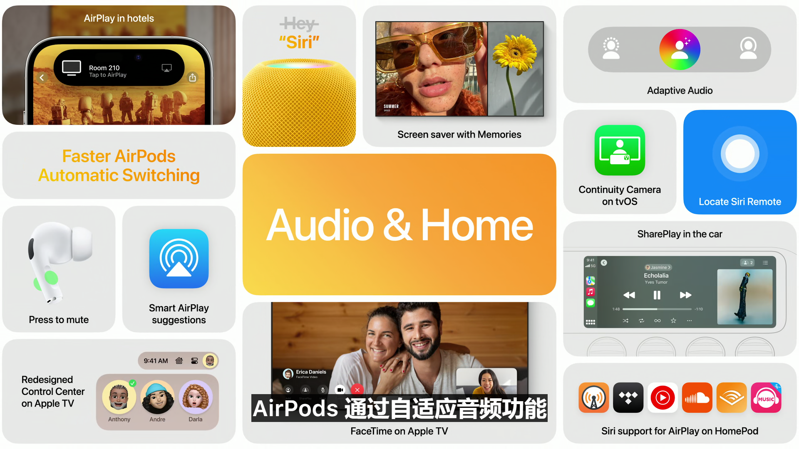

# [WWDC 2023](https://developer.apple.com/cn/wwdc23/) 大会笔记

### 本次大会重点预测：
- MR头显 及 xrOS
- iOS 17 / iPad OS 17
- watchOS 10
- macOS 14
- M3 芯片（最先搭载MacBook Air）

### 发布会开始时间：
`太平洋夏令时间 6 月 5 日上午 10 点` / `北京时间 6 月 6 日 上午 1 点`

---

### Part 1：一段广告

抓泡泡！

使用Mac编写(IDE是XCode)

泡泡！

好大的泡泡！

估计这段和虚拟现实有关

泡泡代表轻薄

---

### Part 2：库克叔叔来引

---

### Part 3 : Mac

#### 第一部分：MacBook Air

15.3 寸 MacBook Air（好大...

- 厚度 11.5 mm
- 重量 3磅
- Magsafe 充电接口
- 5mm 边框
- 1080p 摄像头
- 三麦克风阵列
- 六扬声器系统
- M2芯片
- 18小时电池续航
- 没风扇！！

这一段基本上都是在介绍这个新的 MacBook Air

#### 第二部分：Mac Studio

**M2 Ultra**

- 4核 CPU
- 76核 GPU
- 192GB 统一内存

#### Mac Pro

- 搭载M2 Ultra
- 内置7张Afterburner
- 24条4K视频

---

### Part 4：iOS 17

### Phone（电话）:

Contact Poster

Live Voice Mail:

### FaceTime（国内没法用）

### Messages（短信）

- 智能搜索
- 语音转文本

这个估计是iMessage **（好消息，iMessage国内可以用）** ，而且需要家人共享

### AirDrop（隔空投送）

NameDrop（小天才电话手表）

### KeyBoard（键盘）

Autocorrect（自动纠正）

实时预测（Github Copilot）

### Memories（相册里面那个回忆）

Journal（手记）

这是新的第一方APP！！！

### 待机（Apple Watch上面的那个床头钟）

貌似只支持 iPhone 14 Pro / Pro Max（需要全天候显示）

### 其他

- Hey Siri "Hey"没了
- 离线地图

**什么？没有介绍侧载？**

---

#### Part 4：iPadOS 17

### 小组件和锁定屏幕

- 小组件可以互动了！
- 自定义锁定屏幕（好帅啊！！）
- 锁屏左边可以添加小组件了

### 实时活动

- iOS的那堆全搬过来了

### 健康APP

### PDF文件

- 快速识别输入框
- Notes（备忘录）APP
- - 批注
- - 协作

### 其他

- 台前调度
- 显示器内置的摄像头
- 无边记APP 新增新的笔

---

#### Part 5：MacOS 14（Sonoma）

### 之前在iOS和iPadOS介绍的功能也会过去

### 屏幕保护程序

- 那个锁屏好看！！

### 小组件

- 小组件可以拽到桌面了
- iPhone的小组件可以直接添加到Mac上（需要连接到同一个WiFi）

#### 游戏（真的有人在Mac上打游戏？？）

- Metal 4
- 游戏模式（硬件性能优先级给到游戏）
- 双倍蓝牙速率，降低延迟

### 视频会议（Facetime、Zoom、Teams）

- 可以把演讲课件放到人物的后面

## Safari

- 和家人共享Safari里保存的密码（iCloud钥匙串）
- 更强的无痕模式
- 多用户模式（Profile）（Chrome: ?）
- 网页应用（Edge：？）

---

#### Part 6：AirPods（这段好像带着 AirPods有效果）

### 自适应音频

- 分离噪声的同时可以让你听到你需要的环境声音
- 通话时自动降噪
- 更快的切换设备

### AirPlay & CarPlay

- 支持隔空投放的酒店（Apple生态酒店确信）
- CarPlay 加入 SharePlay

---

#### Part 7：tvOS & Apple TV（与国内无关）

- 更快速的任务栏
- iPhone可以找Siri Remote了
- 屏幕保护程序
- FaceTime现在适用于Apple TV

---

#### Part 8：watchOS 10

（看到那个短片的时候我好激动啊）

### 表盘界面

- 滚动可以看小组件了！（Siri表盘）
- 新表盘：调色盘、史努比！

### 系统APP

- 好多软件全部重新设计了！（演示了天气、健身记录）

### 骑行健身记录

- 可以连接支持蓝牙的单车传感器了
- 可以在iPhone上查看骑行的健身记录了

### 健走健身记录 & 指南针

- 会自动生成记录点了
- - 最后一次连接运营商的地点
- - 可以使用SOS紧急呼救的地点
- 可以三维查看了！

### 地图（没故宫）

- 等高线！
- 可以直接查看徒步爬行等信息

### 健康

**心理健康！！！！（卧槽我快乐死了）**

（正念APP）

- 记录某个情绪点或者每天的心情
- 评估表检查当前抑郁&焦虑的风险程度，并提供文章和资源

**视力健康**

- 可以统计在白天里的时间
- 屏幕距离（原深感）

**没有那个AR设备欸**

---

# One more thing...

---

## 终极篇章：Apple Vision Pro & visionOS

- 啥也不说了，我已经不知道怎么总结了
- 好牛逼啊！！
- 但是好多环大陆服务
- M2 + R1